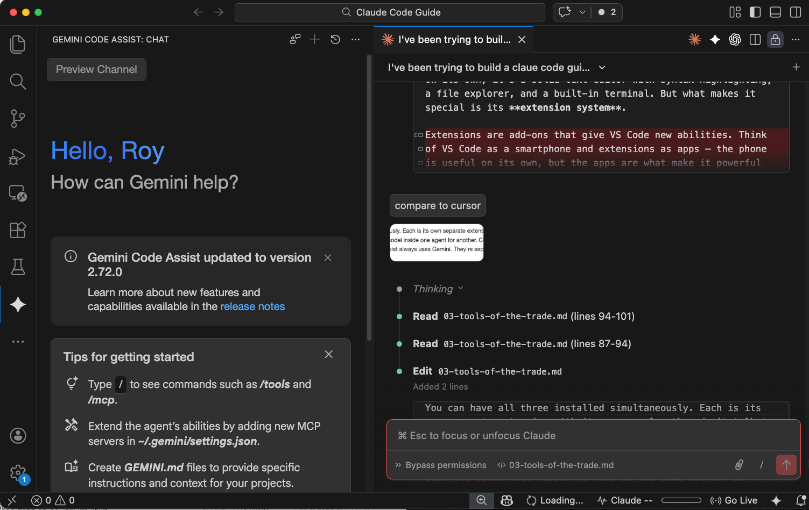

## Chapter 3: Tools of the Trade

> **TL;DR:** There are five ways to work with AI: talk to it in a chat, use a platform that builds and hosts software for you, deploy enterprise agents that handle your customers, connect your apps with workflow automation, or use an agent workspace where you control the files and decisions. This chapter maps the landscape.

---

When people say "I built this with Claude" or "I used GPT to make my website," they're skipping a layer. You don't work with the AI model directly — or rather, you *can*, but it's just one of five approaches. Each puts a different amount of machinery between you and the model, and that machinery decides how much control you get.

### Chat interfaces

This is where most people start. You open a website — ChatGPT, Claude.ai, Gemini — type what you want, and the model responds. That's it. No files, no project, no automation. Just a conversation.

Chat works well for small, self-contained tasks: "write me a function that validates email addresses," "generate the HTML for a pricing table," "explain what this error message means." You copy the output, paste it wherever you need it, and move on.

And it's not just code. People use chats for writing, research, brainstorming, analysis — anything where you want a quick answer or a draft. Need a marketing email? A summary of a long document? A meal plan? Chat handles that fine.

The limitation shows up when the task gets bigger. Say you're writing a guide with ten chapters — each one a separate file, with cross-references between them, images, a glossary, and a consistent voice throughout. In a chat, you'd have to paste content in, get output back, paste it into the right file, remember what you changed in chapter 3 when you're working on chapter 7. The model can't see your files, can't remember what you did earlier, and can't work across multiple documents at once. You become the glue holding the project together.

That's where the line between a chat and an agent workspace becomes clear. It's not about code vs. non-code — it's about whether your task lives in a single conversation or spans multiple files and sessions. A chat is a conversation. An agent workspace is a working environment.

| Tool | Notes | Price |
|---|---|---|
| **ChatGPT** | OpenAI. Most widely used chat interface. | Free tier; Plus \$20/mo |
| **Claude.ai** | Anthropic. Strong at code and longer conversations. | Free tier; Pro \$20/mo |
| **Gemini** | Google. Integrated with Google services. | Free tier; Advanced \$20/mo |

### E2E software building platforms

These tools are specifically for building software. They run entirely in the cloud. You describe what you want — in plain language — and the platform builds it, hosts it, and deploys it for you. You might never touch a file directly. Just describe, preview, tweak, and publish. If you're not building software (websites, apps, tools), this category isn't for you — stick with chat interfaces.

The appeal is speed. You can go from idea to working prototype in minutes. The platform handles the technical decisions: what framework to use, how to structure the code, where to host it. You focus on *what* you want, not *how* to build it.

The tradeoff is control. You work within what the platform supports. If you need a specific database, a custom component, or a feature the platform doesn't offer — you're stuck. And your project lives on their servers. If they shut down, change pricing, or deprecate a feature, your project is affected. Moving your code elsewhere can range from inconvenient to impossible.

| Platform | Specialty | Price | Notes |
|---|---|---|---|
| **Replit** | Full-stack apps | Free tier; paid from \$25/mo | Complete dev environment in browser, built-in hosting, good for learning |
| **Lovable** | Web apps from descriptions | Free tier; Pro \$25/mo, Business \$50/mo | Describe what you want in plain language, it builds and deploys |
| **v0** (Vercel) | UI and front-end design | Free tier; paid from \$20/mo | Strong at generating interfaces and components, deploys through Vercel |
| **Base44** | All-in-one app building | Free tier; paid from \$19/mo | Describe, build, host — lowest learning curve |

> **If you want to start working on apps, try an E2E platform first.** Try Lovable, Replit, or one of the others. The value-for-money is excellent for straightforward projects. You'll have something working in minutes, not hours.
>
> But here's the real reason: you need to hit the wall. Every platform has limits — a component you can't customize, a database you can't connect, a feature that's just not possible within the platform's boundaries. When you hit that wall, you'll understand *why* agent workspace platforms exist and what they give you. That understanding makes the transition natural instead of forced.

### Enterprise agent orchestration platforms

These platforms don't help *you* build software — they help businesses deploy AI agents that handle operations. Customer service, sales, support, onboarding. The agents talk to customers, look up orders, process returns, schedule appointments — across chat, voice, email, and messaging apps.

The key difference from everything else in this chapter: you're not the one talking to the agent. Your *customers* are. You set up the agents, define what they can do, connect them to your systems (order database, CRM, knowledge base), and the platform orchestrates everything behind the scenes. Multiple specialized agents work together — one handles billing questions, another handles returns, a third escalates to a human when it's stuck.

| Platform | What it does | Notes |
|---|---|---|
| **Sierra** | Customer experience agents — service, sales, account management. Agents remember previous conversations with the same customer. | Founded by Salesforce's former co-CEO. \$10B valuation. Uses multiple AI models behind the scenes, each picked for what it does best. |
| **Google Vertex AI Agent Builder** | Build and deploy agents with connectors to 100+ enterprise systems (SAP, Salesforce, Oracle). | Part of Google Cloud. Low-code, production-ready. Best for organizations already on Google Cloud. |
| **Microsoft Copilot Studio** | Low-code agent builder integrated with Microsoft 365, Teams, and Outlook. | Tightly bundled with the Microsoft ecosystem. Strong governance and policy controls. |
| **Salesforce Agentforce** | Multi-agent platform built into Salesforce CRM. Agents handle sales, service, and marketing workflows. | Best for companies already using Salesforce. Agents work directly with your CRM data. |
| **ServiceNow AI Agent Orchestrator** | Teams of specialized agents that collaborate across IT, HR, and operations. | Best for IT-heavy organizations. Agents coordinate multi-step tasks across departments. |

These platforms are expensive — enterprise pricing, often custom-negotiated, with full deployments running \$500K–\$2M. They're designed for companies with high customer volume, not personal projects. But they're worth knowing about because they show where agents are headed: not just tools you talk to, but systems that run autonomously on behalf of a business.

### Workflow automation platforms

These tools connect your existing apps together. "When a new lead comes in from my website form, add them to my spreadsheet, send them a welcome email, and notify me on Slack." No coding — you build the workflow visually by connecting blocks.

They're not AI agents themselves, but they've become a natural home for agent-powered steps. All three major platforms now let you drop an AI block into a workflow: "When a customer emails, have Claude summarize it, classify the intent, and route it to the right team." The automation handles the plumbing; the AI handles the thinking.

| Platform | Ease of use | Price | Notes |
|---|---|---|---|
| **Zapier** | Easiest — guided, linear setup. Best for non-technical users. | Free tier; paid from \$20/mo | 7,000+ app integrations. The largest library by far. If the app exists, Zapier probably connects to it. |
| **Make** | Visual drag-and-drop builder. More powerful than Zapier, slightly steeper learning curve. | Free tier; paid from \$10/mo | ~60% cheaper than Zapier for comparable usage. Good middle ground between simplicity and power. |
| **n8n** | Most powerful, steepest learning curve. Node-based workflow builder. | Free (self-hosted); cloud from \$24/mo | Open source. Can run on your own server. Best for people who want full control over their automations. |

If you find yourself doing the same manual steps over and over — copying data between apps, sending notifications, updating spreadsheets — a workflow automation platform can eliminate that busywork. Start with Zapier if you want the gentlest learning curve.

### Agent workspace platforms

This is where the rest of this guide lives.

Agent workspace platforms install on your computer. Your files live on your machine. The AI agent reads your files, takes instructions, writes code, runs commands — all locally. When you're done, the files are right there on your hard drive, in folders you control.

The platform layer here is thin. It connects you to the AI model and gets out of the way. You pick your own tools, your own framework, your own database. You decide where and how to deploy. The agent is powerful — it can make changes across multiple files, run your tests, browse the web for documentation — but *you* are the one making the decisions.

More setup, more to learn, full control.

#### Two ways to talk to your computer

Before we look at specific tools, you need to understand two interfaces — because the tools below use one or both.

**CLI (Command Line Interface)** — A text-only way to talk to your computer. No buttons, no menus. You type a command, press Enter, get a result. If you've ever seen a black screen with green text in a movie — that's it (though in real life it's usually white text on a dark background). Think of it like the old DOS prompt: `C:\> dir` listed your files, `C:\> copy file.txt backup.txt` copied them. The Mac/Linux equivalent is called a **terminal**. Same idea, different name.

**IDE (Integrated Development Environment)** — A visual application where you write code. It looks like a souped-up text editor with extra powers: it can highlight syntax in color, catch errors as you type, manage your project files in a sidebar, and run your code with a button click. Think of it as the difference between writing in Notepad vs. writing in Word — same content, but one gives you a lot more help. Examples: VS Code, Cursor, Windsurf, Antigravity.

The key distinction: a CLI is text commands, an IDE is a visual application. Some tools work in both — Claude Code started as a pure CLI tool but now also runs as an extension inside VS Code (an IDE). You'll see this pattern: the boundary between CLI and IDE is blurring.

#### The tools

| Tool | Interface | AI Model | Agent capabilities | Price |
|---|---|---|---|---|
| **VS Code** | IDE | Works with all AI agents via extensions — Claude Code, GitHub Copilot, and others. | Not an agent itself — it's the editor. Agents plug into it. The foundation that Cursor, Windsurf, and Antigravity are all built on. | Free |
| **Claude Code** | CLI + VS Code extension | Claude (Anthropic). Can also call other models via API for specific tasks. | Can spawn **sub-agents** — smaller agents that run tasks in parallel (e.g., one researches while another codes). Also supports tool use: reading files, running commands, browsing the web. The most autonomous of the group. | Included with Claude Pro (\$20/mo) or Max (\$100–200/mo); also API-based |
| **Cursor** | IDE (standalone app) | Claude, GPT, Gemini, and others — you switch models freely, even mid-conversation | Single agent, but you can choose the best model for each task. Strong at inline suggestions and code refactoring within the visual editor. Less autonomous than Claude Code — more of a copilot than an independent agent. | Free tier; Pro \$20/mo |
| **Windsurf** | IDE (standalone app) | Multiple models | Single agent that can make changes across multiple files and understand broader project context. Similar to Cursor in capability. | Free tier; Pro \$15/mo |
| **Codex** (OpenAI) | VS Code extension + cloud | OpenAI's models (GPT, o-series). | OpenAI's autonomous coding agent. You give it a task and it works independently in a cloud sandbox — reading files, writing code, running tests — then presents the result. Less real-time interaction than Claude Code; more of a "send it off and review when done" workflow. | Requires OpenAI API key; usage-based pricing |
| **Antigravity** (Google) | IDE (standalone app) | Gemini 3, Claude, GPT (you choose) | **Manager View** lets you dispatch multiple agents to work on different tasks simultaneously — closest to true orchestration in an IDE. Agents generate verifiable artifacts (plans, task lists) so you can review their logic. Still in public preview. | Free during preview; expected ~\$20/mo Pro |

#### VS Code: the foundation

**VS Code (Visual Studio Code)** is a free IDE made by Microsoft. It's the most widely used code editor in the world. On its own, it's a solid text editor with syntax highlighting, a file explorer, and a built-in terminal. But what makes it special is its **extension system**.

Extensions are add-ons that give VS Code new abilities. Think of VS Code as a smartphone and extensions as apps — the phone is useful on its own, but the apps are what make it powerful for *your* specific needs. You install extensions with a few clicks inside VS Code — no terminal commands, no configuration files.

This matters because multiple AI agents can run inside VS Code as extensions, and you can install more than one at a time. Each brings a different model and different strengths:

- **Claude Code** — Anthropic's agent. The most autonomous of the group. It can read your entire project, make changes across multiple files, run commands, and spawn sub-agents to work in parallel. Uses Claude as its model.
- **GitHub Copilot** — Microsoft/OpenAI's agent. Built into VS Code natively. Strong at inline code suggestions — it predicts what you're about to type and offers completions as you go. Uses GPT and Codex models. Included free with VS Code, with a paid tier for more features.
- **Codex** — OpenAI's autonomous coding agent. Works like Claude Code — you give it a task and it works independently: reading files, writing code, running tests. Uses OpenAI's models. Currently in preview; requires an OpenAI API key.
- **Gemini Code Assist** — Google's agent. Connects to Gemini models. Good at explaining code and answering questions about your project. Free tier available.

You can have all of these installed simultaneously. Each is its own separate extension with its own panel — they don't talk to each other, and you can't swap the AI model inside one agent for another. Claude Code always uses Claude, Copilot always uses GPT, Codex always uses OpenAI's models, Gemini Code Assist always uses Gemini. They're separate tools that happen to live in the same editor. In practice, many developers use Copilot for quick inline suggestions while using Claude Code or Codex for larger tasks that require more autonomy.

**This is the key difference from Cursor.** Cursor is built on top of VS Code, but it takes the opposite approach: one agent, many models. Instead of installing separate extensions for each AI, Cursor lets you switch between Claude, GPT, Gemini, and others from a single dropdown — even mid-conversation. That's convenient if you want to try different models for different tasks without juggling multiple extensions. The tradeoff: Cursor costs \$20/mo on top of whatever the AI model costs, its agent is less autonomous than Claude Code — more of a copilot than an independent agent — and it limits how much you can use each model. You get a monthly quota per model, and once you hit the cap, you either wait or switch to a cheaper model.

**Windsurf and Antigravity** also built on VS Code's open-source foundation, each baking their own AI features directly into the editor. That's why they all look similar (same sidebar, same file explorer, same layout) but each has its own approach to AI built in rather than added as extensions.

So when you learn VS Code, you're not learning one tool — you're learning the interface that nearly every agent workspace platform uses.

#### Claude Code: terminal or VS Code?

Claude Code is the only tool here that works in two very different interfaces. Which one you use depends on your comfort level:

| | Terminal (CLI) | VS Code extension |
|---|---|---|
| **Looks like** | Text on a dark screen. You type commands, agent responds in text. | A familiar visual editor with files in a sidebar, syntax highlighting, and the agent in a panel. |
| **Strengths** | Full power, nothing hidden. Faster for experienced users. Easier to script and automate. | Less intimidating for beginners. You can see your files and code visually while the agent works. |
| **Best for** | People comfortable with a terminal, or those willing to learn. Power users. | People who want a visual safety net. If the terminal feels alien, start here. |

Same agent, same capabilities, same model underneath. The difference is purely how you interact with it.

#### What all agent workspace platforms share

- Your files stay on your computer
- You can use **Git** (a version control system — think of it as an infinite undo button that also lets multiple people work on the same project) to track changes (we'll cover Git and GitHub in Chapter 5)
- You choose where and how to deploy your project when it's ready
- You need to understand at least the basics of your project's structure

### What this guide recommends

For the agent workspace path, this guide uses **VS Code + the Claude Code extension**. Here's why:

VS Code is free and has a massive ecosystem of extensions. The Claude Code extension gives you the full power of Claude's agent — sub-agents, tool use, web browsing, autonomous execution — inside a visual editor where you can see your files and code. You get the best of both worlds: a proper IDE for when you want to look at things, and a powerful agent for when you want things done.

**What about Cursor?** Cursor is a strong alternative. Since it's built on VS Code, it looks and feels similar — but it ships with its own AI agent baked in rather than using an extension. Two advantages: it lets you switch between AI models mid-conversation (Claude today, GPT tomorrow, Gemini for a quick cheap task), and its inline code suggestions are polished. The tradeoff: it costs \$20/mo on top of whatever you pay for the AI model, and its agent is less autonomous than Claude Code — it's more of a copilot that works alongside you than an independent agent you dispatch.

**What about Codex?** OpenAI's Codex is Claude Code's closest competitor in terms of autonomy. You give it a task and it works in a cloud sandbox — reading files, writing code, running tests. The key difference: Codex runs in the cloud and presents results when done, while Claude Code runs on your machine in real time so you can watch and intervene. Codex requires an OpenAI API key with usage-based pricing. If you're already in the OpenAI ecosystem, it's worth trying alongside Claude Code.

Both are solid choices. This guide uses Claude Code because it teaches you the most about how agents actually work — and because you can start with a tool you already have access to through a Claude subscription.

**One more tool worth mentioning: Wispr Flow.** [Wispr Flow](https://wisprflow.com) isn't an agent — it's a voice-to-text tool that runs system-wide on your computer. You speak, it transcribes. Why mention it here? Because a huge part of working with agents is *telling them what to do*, and talking is faster than typing. Wispr Flow works anywhere — in the Claude Code panel, in a chat, in a document. Especially useful when you're iterating on feedback ("make the heading bigger, move the image left, change the tone in paragraph three") where speaking is more natural than typing.

### Comparison at a glance

| | Chat interfaces | E2E software building | Enterprise orchestration | Workflow automation | Agent workspaces |
|---|---|---|---|---|---|
| **Tools** | ChatGPT, Claude.ai, Gemini | Replit, Lovable, v0, Base44 | Sierra, Google Vertex, Copilot Studio | Zapier, Make, n8n | Claude Code, Cursor, Windsurf |
| **How it works** | You ask, it answers. You copy the output. | You describe, it builds and hosts. | Agents handle your customers across chat, voice, email. | Connect apps: "when X happens, do Y." | An agent reads your files, writes code, runs commands on your machine. |
| **Who uses it** | Anyone. | People building apps and websites. | Businesses with high customer volume. | Anyone automating repetitive tasks. | People building projects they want to own. |
| **Setup** | Sign up, start talking. | Sign up, start building. | Enterprise deployment with IT team. | Sign up, connect your apps. | Install the tool, configure API key. |
| **Price** | Free–\$20/mo | Free–\$50/mo | Enterprise (\$500K+) | Free–\$100/mo | Free–\$200/mo |
| **Learning curve** | Lowest | Gentle | High (enterprise IT) | Low to moderate | Steeper |
| **Best for** | Quick questions, drafts, one-off tasks. | Prototypes, MVPs, landing pages. | Customer service, sales, support at scale. | Connecting apps, eliminating manual steps. | Projects you want to own, customize, and maintain. |

---

### More reading

- [Cursor vs Windsurf vs Claude Code: The Honest Comparison (DEV Community)](https://dev.to/pockit_tools/cursor-vs-windsurf-vs-claude-code-in-2026-the-honest-comparison-after-using-all-three-3gof) — A side-by-side review from a developer who used all three tools on real projects, covering context handling, pricing, and workflow differences.
- [Best AI Coding IDE 2025: Cursor vs Antigravity vs Claude Code vs Windsurf (HumAI)](https://www.humai.blog/best-ai-coding-ide-2025-cursor-vs-antigravity-vs-claude-code-vs-windsurf-the-complete-comparison/) — A detailed comparison including Antigravity's Manager View and how each tool handles multi-agent workflows.
- [The Fastest Way to Start Coding with AI Tools — A Beginner's Guide (Geeky Gadgets)](https://www.geeky-gadgets.com/beginners-guide-to-ai-coding/) — A step-by-step roadmap for non-coders, starting with conversational AI and progressing to no-code platforms and agent-assisted tools.
