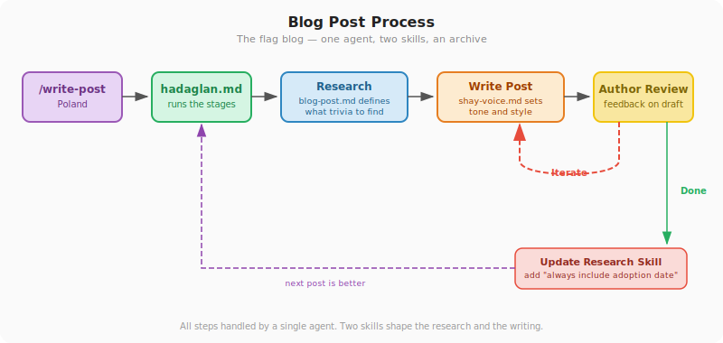

## Chapter 6: How It All Comes Together

> **TL;DR:** There's a recommended process for working with agents that scales from simple tasks to complex projects. You give input, an orchestrator dispatches the work, an explorer gathers context, an actor does the job, and a reviewer checks it. Iteration loops until it's right. Then you review what happened and improve the process for next time.

---

Chapter 5 introduced the building blocks: commands, skills, agents, rules, memory. Each one does one thing. This chapter shows what happens when they work together as a system.

### The process

Here's a best practice for structuring agent work. You don't have to follow it rigidly — but the more of it you adopt, the better your results will be:

Five roles, one loop:

1. **User input.** You start the process — a prompt, a spec, a command. This is the brief.
2. **Orchestrator.** Something coordinates the work. In a simple process, this is a command file (the recipe from Chapter 5). In a complex one, it's a manager agent that dispatches sub-agents.
3. **Explorer.** Before any work happens, someone gathers context. What already exists? What are the constraints? What needs to change? The explorer does the homework.
4. **Actor.** The one who does the work — writes the code, drafts the post, cleans the data. This is the developer, the writer, the doer.
5. **Reviewer.** Someone checks the output. In simple tasks, that's you. In complex ones, it might be a reviewer agent followed by you. If the work isn't right, it goes back to the actor — this is the **iteration loop**. It runs until the reviewer approves.

After the work is done, two more steps are recommended:

- **Post-mortem.** Review what happened. What went well? What took too long? What broke?
- **Change process.** Feed those learnings back into the system — update a rule, fix a command, add a guardrail. The next run is smoother because this one happened.

You can start with just the first five roles and skip the post-mortem entirely. But if you want your agent work to get better over time — not just task by task, but structurally — the last two steps are what make that happen.

The rest of this chapter shows how this looks in practice — a real example of the process at work. Chapter 7 then walks through every step of building this system, so you can set it up yourself. Chapter 8 shows the same process at a larger scale, with multiple agents building software.

### Example 1: Writing a blog post

A friend of mine writes a blog about flags — vexillology, the study of flag design and symbolism. He set up a system where typing `/write-post Poland` produces a full draft in his voice. Here's how the process maps:

The command file (`content-manager.md`) is the orchestrator — it defines the stages. First, a **research skill** (`blog-post.md`) tells the explorer what kind of trivia to look for: origin stories, hidden symbolism, design oddities, human stories behind the flag. The explorer searches the web, collects data organized by those categories, and checks the archive of previous posts to avoid repeating what's been covered.

Then a **voice skill** (`shay-voice.md`) tells the writer how the author sounds. This file was generated by having the agent analyze the archive of 89 previous posts and describe the writing style — sentence patterns, tone, humor, structure. The author reviewed it, made corrections, and saved it as a reusable skill. The writer drafts the post in that voice. The author reviews, gives feedback ("too formal in the opening," "the coat of arms section needs more detail"), and the agent revises. Two or three rounds and he has a publishable post.

After a few posts, the author noticed the agent kept missing adoption dates. He added a line to the research skill: "always include the adoption date." Next post, the agent got it right. The process improved because the last run surfaced the gap.

| Process role | What did it | Config layer (Ch5) |
|-------------|-------------|-------------------|
| **Orchestrator** — `content-manager.md` | Triggered the workflow, defined the stages | Command |
| **Explorer** — research + archive check | Used `blog-post.md` skill to know what trivia to look for, searched the web, checked archive for previous coverage | Skill + reference data |
| **Writer** — draft in author's voice | Used `shay-voice.md` (generated from old posts) to write in the author's style | Skill |
| **Reviewer** — the author | Gave feedback, iterated until satisfied | Human review |
| **Change process** — updated research skill | Fixed a recurring gap (missing adoption dates) | Skill |

One command. Two skills. An archive. Chapter 7 walks through the full setup — how the archive was built, how the voice skill was created, and how to build this kind of system for your own work.

---

### Practical tips

> **Start simple, add agents later.** Your first tasks should use a single agent with a command file. Get comfortable with the input-explore-work-review loop before introducing sub-agents. Most tasks don't need a five-agent team.

> **The iteration loop is where the value is.** The first draft is never the final version — for blog posts or software. Get comfortable giving specific feedback: not "this isn't right" but "the introduction is too formal" or "the button should be on the left." The agent improves with each round.

> **Always do the post-mortem.** Even a quick scan of what happened tells you what to change. This is how your process gets better over time — not by reading documentation, but by reviewing your own work.
