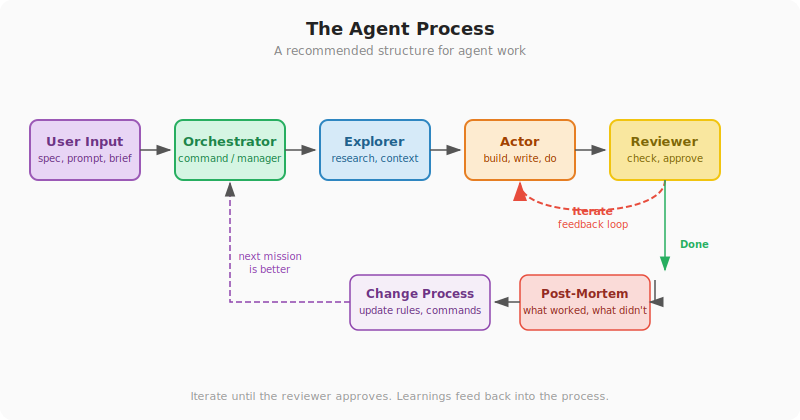

## Chapter 6: How It All Comes Together

> **TL;DR:** There's a recommended process for working with agents that scales from simple tasks to complex projects. You give input, an orchestrator dispatches the work, an explorer gathers context, an actor does the job, and a reviewer checks it. Iteration loops until it's right. Then you review what happened and improve the process for next time.

---

Chapter 5 introduced the building blocks: commands, skills, agents, rules, memory. Each one does one thing. This chapter shows what happens when they work together as a system.

### The process

Here's a best practice for structuring agent work. You don't have to follow it rigidly — but the more of it you adopt, the better your results will be:



Five roles, one loop:

1. **User input.** You start the process — a prompt, a spec, a command. This is the brief.
2. **Orchestrator.** Something coordinates the work. In a simple process, this is a command file (the recipe from Chapter 5). In a complex one, it's a manager agent that dispatches sub-agents.
3. **Explorer.** Before any work happens, someone gathers context. What already exists? What are the constraints? What needs to change? The explorer does the homework.
4. **Actor.** The one who does the work — writes the code, drafts the post, cleans the data. This is the developer, the writer, the doer.
5. **Reviewer.** Someone checks the output. In simple tasks, that's you. In complex ones, it might be a reviewer agent followed by you. If the work isn't right, it goes back to the actor — this is the **iteration loop**. It runs until the reviewer approves.

After the work is done, two more steps are recommended:

- **Post-mortem.** Review what happened. What went well? What took too long? What broke?
- **Change process.** Feed those learnings back into the system — update a rule, fix a command, add a guardrail. The next run is smoother because this one happened.

You can start with just the first five roles and skip the post-mortem entirely. But if you want your agent work to get better over time — not just task by task, but structurally — the last two steps are what make that happen.

Every example in this chapter — and in Chapter 7 — is an implementation of this process. Some add complications, some use multiple agents, but the recommended structure is the same.

### Example 1: Writing a blog post

A friend of mine writes a blog about flags (we'll see more of this in Chapter 7). He set up a system where typing a single command produces a full draft in his voice. Here's how it maps to the process:

```
/write-post Poland
```

**Orchestrator: the command file.** The command (`.claude/commands/write-post.md`) is the recipe — a plain-text checklist that tells the agent what to do and in what order:

```markdown
Write a blog post about the flag of $TOPIC.

Steps:
1. Check archive.md — has this flag been covered before?
2. Read editorial-guide.md for what to include.
3. Search the web for current information about this flag.
4. Write the post using the voice skill for tone and style.
5. Present the draft for review.
```

**Explorer: checking the archive.** First step: the agent reads `archive.md` — a file containing every previous post — to see if Poland's flag has been covered. If it has, the agent notes what exists and looks for new angles. This is the exploration phase.

**Actor: writing the post.** The agent researches online, loads the **voice skill** (`.claude/skills/voice.md` — a file describing how the author writes), and drafts the post. The voice skill is what makes the output sound like him instead of generic AI text.

**Reviewer: the author.** The agent presents the draft. The author gives feedback: "Too formal in the opening," "The coat of arms section needs more detail." The agent revises. Two or three rounds — the iteration loop — and he has a publishable post.

**Post-mortem / change process:** After a few posts, the author noticed the agent kept missing adoption dates. He added a rule to the editorial guide: "Always include the adoption date." Next post, the agent got it right. The process improved because the last run surfaced the gap.

#### What orchestrated this?

| Process role | What did it | Config layer (Ch5) |
|-------------|-------------|-------------------|
| **Orchestrator** — `/write-post` | Triggered the workflow, defined the steps | Command |
| **Explorer** — archive check | Gathered context on what's been covered | Reference data |
| **Actor** — the agent + voice skill | Wrote the post in the author's style | Skill |
| **Reviewer** — the author | Gave feedback, iterated until satisfied | Human review |
| **Change process** — updated editorial guide | Fixed a recurring gap | Rule / project doc |

One command. Four reference files. A single agent wearing multiple hats (explorer, then actor). The human reviewed and iterated. The process improved.

### Example 2: Building a software feature

Same process, bigger scale. When the task is building a feature — not writing a post — the roles get split across specialized **sub-agents** instead of one agent doing everything. Think of it like a film crew: the director doesn't also hold the camera, do the lighting, and edit the footage.

#### The cast

| Process role | Agent | What it does |
|-------------|-------|-------------|
| **Orchestrator** | Manager | Dispatches agents, tracks progress, enforces gates |
| **Explorer** | Explorer | Reads the codebase, identifies what needs to change |
| **Actor** | Developer | Writes the code, runs tests, deploys |
| **Reviewer** | Reviewer | Checks quality, approves or sends back |

These are **custom agents** — the same concept from Chapter 5. Each is a markdown file that defines what the agent does, what it can access, and how it behaves.

#### How it flows

**1. User input.** "Add a search feature to the app." This goes to the manager agent.

**2. Orchestrator dispatches explorer.** Before anyone writes code, the explorer reads through the existing project — what's already built, what needs to change, where the new feature connects to existing pieces. Its findings go into a **spec file** — a tracking document that stays with the process.

**3. Explorer hands off to a planner.** Based on the findings, a plan gets written: what to build, in what order, what depends on what. You approve the plan before any code is written. This is a **gate** — the process pauses until you say "go."

**4. Actor builds.** The developer writes code in small steps — finishing one piece, testing it, then moving to the next. Progress gets logged in the spec file.

**5. Reviewer checks.** The reviewer reads the code, checks for quality issues, and either approves or sends it back with feedback. Another gate. If the work isn't right, it goes back to the developer — the iteration loop.

**6. You test.** The developer deploys to a preview environment. You test it. If something's wrong ("the search results are in the wrong order," "the filter doesn't work on mobile"), you give feedback and the developer iterates.

**7. Post-mortem.** After the work is done, a **sprint file** records what happened: which tasks were completed, what issues came up, what decisions were made. You review it. What went well? What took too long?

**8. Change process.** Learnings feed back into the rules and configuration. Maybe the explorer missed a database table — you add a step to the exploration checklist. Maybe the reviewer caught the same formatting issue three times — you add a rule. The system improves.

#### Same process, more moving parts

The blog post used one agent wearing all the hats. The software sprint uses five agents, each in a dedicated role. But the recommended structure is the same:

**User input → Orchestrator → Explorer → Actor → Reviewer → (iterate) → Post-mortem → Change process**

The number of agents changes. The complexity of the work changes. The process scales to fit.

---

### Practical tips

> **Start simple, add agents later.** Your first tasks should use a single agent with a command file. Get comfortable with the input-explore-work-review loop before introducing sub-agents. Most tasks don't need a five-agent team.

> **The iteration loop is where the value is.** The first draft is never the final version — for blog posts or software. Get comfortable giving specific feedback: not "this isn't right" but "the introduction is too formal" or "the button should be on the left." The agent improves with each round.

> **Always do the post-mortem.** Even a quick scan of what happened tells you what to change. This is how your process gets better over time — not by reading documentation, but by reviewing your own work.
